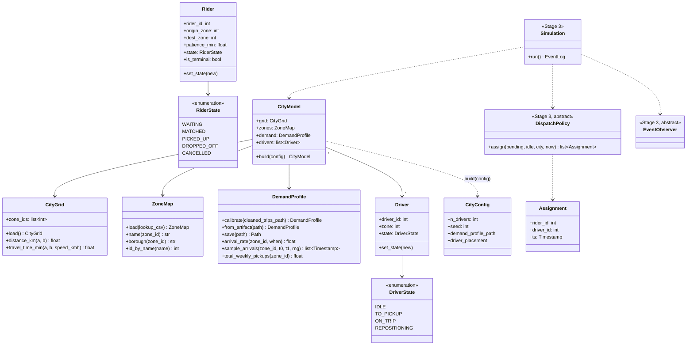

# `ridepulse.sim` — class diagram

Stage 2 scope: `sim.core`. `sim.des` classes (dashed) are added in Stage 3;
`sim.mdp` is an interface stub until Phase 6. See ADR-0002 for the rationale.

```mermaid
classDiagram
    class CityGrid {
      +zone_ids: list~int~
      +load() CityGrid
      +distance_km(a, b) float
      +travel_time_min(a, b, speed_kmh) float
    }
    class ZoneMap {
      +load(lookup_csv) ZoneMap
      +name(zone_id) str
      +borough(zone_id) str
      +id_by_name(name) int
    }
    class DemandProfile {
      +calibrate(cleaned_trips_path) DemandProfile
      +from_artifact(path) DemandProfile
      +save(path) Path
      +arrival_rate(zone_id, when) float
      +sample_arrivals(zone_id, t0, t1, rng) list~Timestamp~
      +total_weekly_pickups(zone_id) float
    }
    class Rider {
      +rider_id: int
      +origin_zone: int
      +dest_zone: int
      +patience_min: float
      +state: RiderState
      +set_state(new)
      +is_terminal: bool
    }
    class Driver {
      +driver_id: int
      +zone: int
      +state: DriverState
      +set_state(new)
    }
    class Assignment {
      +rider_id: int
      +driver_id: int
      +ts: Timestamp
    }
    class CityConfig {
      +n_drivers: int
      +seed: int
      +demand_profile_path
      +driver_placement
    }
    class CityModel {
      +grid: CityGrid
      +zones: ZoneMap
      +demand: DemandProfile
      +drivers: list~Driver~
      +build(config) CityModel
    }
    class RiderState {
      <<enumeration>>
      WAITING
      MATCHED
      PICKED_UP
      DROPPED_OFF
      CANCELLED
    }
    class DriverState {
      <<enumeration>>
      IDLE
      TO_PICKUP
      ON_TRIP
      REPOSITIONING
    }

    CityModel --> CityGrid
    CityModel --> ZoneMap
    CityModel --> DemandProfile
    CityModel "1" --> "*" Driver
    CityModel ..> CityConfig : build(config)
    Rider --> RiderState
    Driver --> DriverState

    class Simulation {
      <<Stage 3>>
      +run() EventLog
    }
    class DispatchPolicy {
      <<Stage 3, abstract>>
      +assign(pending, idle, city, now) list~Assignment~
    }
    class EventObserver {
      <<Stage 3, abstract>>
    }
    Simulation ..> CityModel
    Simulation ..> DispatchPolicy
    Simulation ..> EventObserver
    DispatchPolicy ..> Assignment
```
