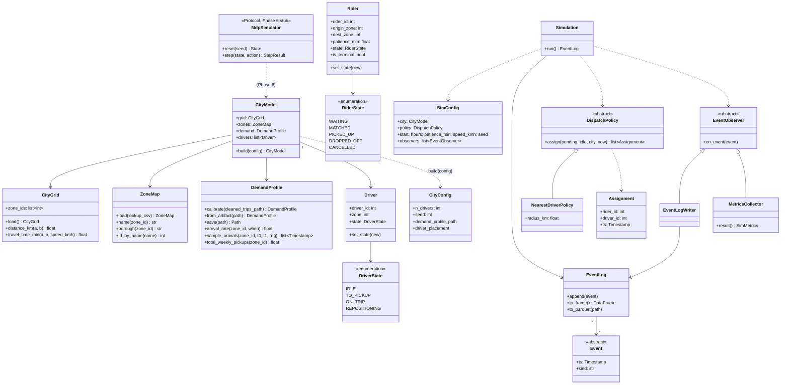

# `ridepulse.sim` — class diagram

`sim.core` (Stage 2) + `sim.des` (Stage 3). `sim.mdp` is an interface stub until
Phase 6. See ADR-0002 (the split) and ADR-0003 (dispatch Strategy, event
Observer).

